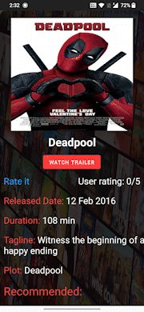

<h1 align="center">Movie Buzz</h1> 

  
A movies info app that fetches data from OMDB API gives a brief information about the movie. 
<b>Search function:</b>&nbsp &nbsp Allows users to search for movies by title, genre, or release date. 
<b>Movie information:</b>&nbsp &nbsp Displays a range of information about the selected movie, such as the title, release date, director, cast, genre, plot summary, runtime, and rating. 
<b><u>Rating and review system:</b>&nbsp &nbsp Allows users to rate and review movies. 
<b>Notifications:</b>&nbsp &nbsp Provides notifications about new releases or upcoming movies. 
<b>Watch Trailers:</b>&nbsp &nbsp Allows users to watch movie trailers directly through the app. 
<b>Intuitive user interface:</b>&nbsp &nbsp Makes it easy for users to search for and access information about their favorite movies. 

 

  
   

## Previews

&nbsp;&nbsp;&nbsp;&nbsp;
&nbsp;&nbsp;&nbsp;&nbsp;
&nbsp;&nbsp;&nbsp;&nbsp;
&nbsp;&nbsp;&nbsp;&nbsp;
&nbsp;&nbsp;&nbsp;&nbsp;

## Tech stack & Open-source libraries
- Minimum SDK level 21
- 100% [Java].
- Volley library for API calls.
- Firebase realtime database database for users comments storage.
- Firebase Google Sign in authentication

